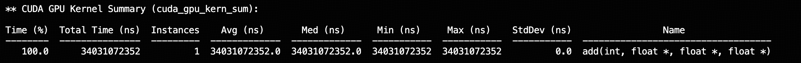
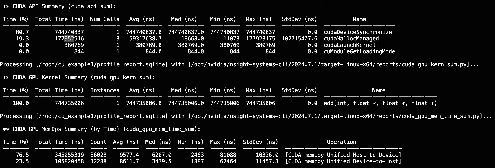

很早就认识到必须懂infra才能将前沿想法推得更深，而不是停留在发论文的想法上。最近有空了准备系统学习一下。
我的基础知识是知道各种大规模训练infra的pipeline，例如DP，FSDP，TP，PP等算法的具体做法，也知道FlashAttention等的算子层面的优化，但是没有手动手写过。
因此总是不清楚某些创新、设计，是否真能在工业界能被用起来，询问相应的infra同学的沟通成本又比较高，idea也无法被准确传达，讨论不深入（例如有些想法可能一开始看起来不能被优化，但是只要动动脑筋，还是可以的，这种在问纯工程视角的同学就比较难打开局面）。

本文将会陆续记录一些我的学习过程，主要是个人记录视角，如果碰巧能有处在同样阶段的朋友可以从中受益，就更好了。

# 1. GPU
本部分内容由[Zomi酱]()的AIsystem系列视频总结而来，感谢Zomi酱系统的讲述

## 1.1 数据存储
GPU算法的优化主要是取决于两个方面: 计算速度和加载数据的速度。加载数据的速度和数据距离计算单元的远近关系巨大，因此我们先从数据存储的位置讲起。

这里面得核心问题是，数据在计算机里是如何存储的。我们常见的硬盘，是一种持久性存储介质，数据在硬盘上的存储是通过修改介质的物理属性来完成的。可想而知，这种存储和擦除会对硬盘造成磨损，存在硬盘上的数据，一般是静态数据，不会经常修改和调整。同时由于要使其物理状态发生改变，其读写速度不会特别快。另一种存储介质是电容器。电容器通过充电形成了极性，可以表示01二进制，但是中学物理告诉我们，非真空中的电容器都是会漏电的（所有电容填充材料都有自己的电导率），因此每隔一定时间（一般是毫秒量级），都需要用一个晶体管电路去刷新电容器；另一方面，电容器的电荷量非常小，为了把其中存的数值用在后续计算中，需要有专门的电路去放大它的电荷。这两点导致这种存储方式虽然比硬盘快了，但是仍然不够快。使用电容器存储的就是我们CPU的主内存（RAM），以及显卡的主内存（一般叫显存，HBM，High Bandwidth Memory）HBM只是比CPU的RAM做得速度更快，带宽更高，本质还是电容器存储）。第三种存储方式是电路（晶体管）。晶体管存储方式是通过反馈电路来实现的。一个存储单元里有6个晶体管，其中核心是一对功能反向的反向耦合晶体管。比如现在需要存0这个状态，第一个晶体管输入0，输出1，这个1输入第二个晶体管，然后第二个晶体管输出0，给第一个晶体管。这样就通过动态的方式实现静态的存储。这种方式将静态存储单元（SRAM）。 与之相对的，前面电容器的存储方式叫动态存储单元（DRAM）。CPU的计算核心和GPU的计算核心里都有大量的SRAM: L1 Cache (GPU里一个流处理器SM自己的共享内存), L2 Cache (GPU所有流处理器共享的内存) 以及计算单元（ALU）的寄存器,。其中寄存器紧随ALU分布，而L1 Cache则稍远，以阵列方式排布，L2 Cache更远。但是可想而知，SRAM的成本高昂，容量较小。

除了本身介质特性带来的存储速度差异，计算单元和这些部件也具有不同的距离，距离带来了不可忽视的延时。电信号(电磁波)在导体中的传播速度是$10^8 m/s$，在距离10cm的远的地方就会带来 $10^{-9}s$的延时。计算机的时钟频率大致在$10^9Hz$, 因此单纯从搬运数据的角度，从DRAM搬运时延已经不可忽略了。

有了这些基本概念，我们就能更清楚的理解所谓带宽和时延。从不同地方取数据的带宽不一样，类似于车道宽窄从主存（CPU DRAM）上取效率12G/s, 从HBM上取1T/s, 从L2、L1上分别在4T/s和20T/s，这个说的就是带宽。另一个概念是时延，这个是说车道长度有多少，从CPU DRAM上时延时1500ns, 从HBD上取400ns，从L2上取是150ns，从L1上则是27ns。

第三个概念是计算强度，说的是从指每单位数据传输所进行的计算量。计算强度越低，对于计算单元来说越好（因为不需要做很多运算就可以抵消传输耗时）。这里的"传输时间"和带宽以及时延都有关。当计算强度很高的时候，降低强度需要提升带宽，因为这时候要传输很多数据，当计算强度已经比较低了，继续降低强度需要降低时延。

带宽只是规定了单位时间同时能传输多少数据，具体要打满这个数，需要真的同时有很多数据在传输。在GPU里，为了达成这个目的用的方法是增加线程数。拿L2 Cache来尝试个不太严谨的计算，时延150ns, 时钟频率是3GHz, 因此在一次传输里，GPU进行了450次计算，而带宽是4000GB/s, 在150ns里，可以传600K字节，因此同时要要传600K/450 =1333K字节数据，假设一个线程传1字节，需要有1333个线程来支持传输。实际上GPU的线程会远远超配，最多支持十几万线程，这里有的用来传数据，有的用来计算，来保证不会卡在线程资源上。


## 1.2 芯片结构

下面是芯片的架构图，以现在的A100为例, 除了上面提到的L1 Cache，L2 Cache， HBM， CPU DRAM， Hard Drive。另一个核心的东西就是流式多处理器SM（Stream Multiprocessor），所有SM共享一个L2 Cache，每个SM单独有一个L1 Cache。每个SM里都有很多个WARP（A100里有64个），每个WARP就是硬件层面，线程划分操控的最小单元，每个WARP有32个线程。每个SM里的所有WARP共享L1 Cache。整个A100GPU有108个这样的SM。不同GPU之间一般由NVLink连接构成，GPU和CPU之间由PCIE连接成。如果是很多GPU，之间可能有汇聚起来的NVSWitch(多对多)。


## 1.3 计算模型

GPU的计算模型是SIMT(Single Instruction Multi Thread), 顾名思义，就是发出一条指令，有多条线程（自动）同时执行这条指令。例如，下面的代码就生动的说明了这个特点。我们只需要写一个函数add, 之后在main函数里调用一次，不需要创建线程，GPU会自动帮我们放到多个线程上去执行。在函数add里，能获取到这个线程的所有标识符，例如blockDim, BlockIdx, ThreadIdx。

```c++
__global__
void add(int N, float* x, float* y, float* z){
    int index = threadIdx.x + blockDim.x * blockIdx.x; 
    int stride = blockDim.x * gridDim.x;
    for (int i = index; i < N; i += stride){
        z[i] = x[i] + y[i];
    }
}
```

GPU的SIMT功能的一个重要的支撑是 SIMD(Single Instruction Multi Data), 这是一种硬件并行计算架构。硬件层面会有多个数据寄存器，但是只有一个指令解码器。除了这个，每个SM里有很多个WARP。

上面提到了所谓标识符Block，它是在CUDA编程模型中的概念（不是硬件层面的概念）。Block（或称为线程块）是线程的一个分组，通常由多个线程组成，用于并行执行特定任务。一个Block可以包含多个WARP，在实际调度过程中，Block会被分配到SM上，并根据需要拆分成多个WARP进行执行。Block的大小（即线程数）有最大限制，这取决于GPU的架构。例如，A100的每个SM支持的最大线程数为2048，因此单个Block的线程数不应超过这个限制。实际中，CUDA对每个Block的线程数也有具体的上限（例如1024线程），以确保资源的合理分配。
    
CUDA调度器会根据SM的空闲资源将Blocks分配到不同的SM上。如果总Block数量小于或等于SM的数量（在A100中为108个），那么这些Blocks有可能会被同时调度到不同的SM上，实现高度并行。但如果总Block数量超过SM的数量，CUDA调度器会将剩余的Blocks排队，等待SM空闲后再进行调度。


# 2. CUDA编程

下面我们来具体看看CUDA 编程。NVCC（NVIDIA CUDA Compiler）是cuda代码的编译器，类似于g++ 编译器对于c++的地位。而且NVCC不仅编译CUDA内核代码（设备代码），还会调用主机编译器（如g++）来编译主机代码。因此，使用`nvcc main.cu -o main && ./main`可以同时编译并链接设备和主机代码，然后运行生成的可执行文件。 

下面是一个完整的代码演示向量A+向量B的代码，如果没有CUDA，我们的代码如下：

```cpp
#include <iostream>
#include <math.h>
#include <chrono>
#include <cuda_runtime.h> //为了方便把后面需要的包全include了

void add(int N, float* x, float* y, float* z){
    for (int i = 0; i < N; i += 1){
        z[i] = x[i] + y[i];
    }
}

void verify_result(int N, float* z){
    float maxError = 0.0f;
    for(int i = 0; i < N; i++){
        maxError = fmax(maxError, fabs(z[i] - 3.0f));
    }
    std::cout << "Max Error: " << maxError << std::endl;
}

int main(){
    int N = 1 << 29;

    float *x, *y, *z;
    x = new float[N];
    y = new float[N];
    z = new float[N];

    for (int i = 0; i < N; i++) {
        x[i] = 1.0f;
        y[i] = 2.0f;
        z[i] = 0.0f;
    }

    auto start = std::chrono::high_resolution_clock::now();
    add(N, x, y, z);
    auto end = std::chrono::high_resolution_clock::now();
    auto duration = std::chrono::duration_cast<std::chrono::milliseconds>(end - start);
    std::cout << "Time: " << duration.count() << " ms" << std::endl;
    
    verify_result(N, z);

    return 0;
}
```

这个代码输出的时间是 3079 ms。这个是用纯CPU进行计算的。那我们想把这个代码变成GPU代码，只需要1. 在add函数前面加__global__ 关键字，这个关键字表示这个函数是一个设备函数，会被放到GPU上跑；2. 在add调用的时候进行`configure`：add<<<1, 1>>>(N, x, y, z) 如果不加这个<<<>>>, 会报错`a __global__ function call must be configured`。这里的<<<1, 1>>> 告诉GPU，用一个block，每个block里一个线程去进行计算，当然这对GPU的利用效率是非常低的。除了效率，你会发现，maxError变成了3。这是为什么呢？原来是因为在cpu上的数组没有被拿到GPU上去，所以这个地址对于GPU而言无效。

有两种方法可以解决
1. 我们需要把new float相关语句换成用unified memory，这是比较新的GPU例如A100提供的新机制。
2. 显式地定义Host Memory和Device Memory, 显式地移动
两者效率区别会稍后研究。

此外，由于设备函数是异步的，还要加上`cudaDeviceSynchronize`，因此我们的代码变成了这样：

```c++
#include <iostream>
#include <math.h>
#include <chrono>
#include <cuda_runtime.h>

__global__
void add(int N, float* x, float* y, float* z){
    for (int i = 0; i < N; i += 1){
        z[i] = x[i] + y[i];
    }
}

void verify_result(int N, float* z){
    float maxError = 0.0f;
    for(int i = 0; i < N; i++){
        maxError = fmax(maxError, fabs(z[i] - 3.0f));
    }
    std::cout << "Max Error: " << maxError << std::endl;
}

int main(){
    int N = 1 << 29;

    float *x, *y, *z;

    // Allocate Unified Memory – accessible from CPU or GPU
    cudaMallocManaged(&x, N*sizeof(float));
    cudaMallocManaged(&y, N*sizeof(float));
    cudaMallocManaged(&z, N*sizeof(float));

    for (int i = 0; i < N; i++) {
        x[i] = 1.0f;
        y[i] = 2.0f;
        z[i] = 0.0f;
    }
    
    add<<<1,1>>>(N, x, y, z);

    cudaDeviceSynchronize();
    
    verify_result(N, z);

    return 0;
}
```

由于我们现在变成了一个异步的操作，所以借助nvidia自带的profiling工具会更好。

### Nsys Profiling
我们尝试运行[Nvidia提供的profiler](https://developer.nvidia.com/nsight-systems/get-started)找到最佳配置。

在linux服务器上直接
```bash
wget https://developer.nvidia.com/downloads/assets/tools/secure/nsight-systems/2024_7/NsightSystems-linux-cli-public-2024.7.1.84-3512561.deb
sudo dpkg -i  NsightSystems-linux-cli-public-2024.7.1.84-3512561.deb 
```

然后`nsys profile --output=profile_report ./add` 来生成报告, 可以用`nsys stats /root/cu_example1/profile_report.nsys-rep` 来查看简要纯文字版报告

我们可以看到上面这个函数的kernel执行时间为34s,远高于cpu执行, 看来不用并行完全比不过CPU啊。


接下来我们合理block数量和blocksize（threadsPerBlock）。前面说了thread实际上是由warp控制，一个SM里有64个warp，一个warp里有32个Thread，所以threadsPerBlock不能开超过2048。但是实际执行发现，开2048会导致计算结果不正确，看来软件上的限制小于一个SM的线程数量2048，运行以下代码查看设备信息
```c++
int device=0;
cudaDeviceProp prop;
cudaGetDevice(&device);
cudaGetDeviceProperties(&prop, device);
std::cout << "Device " << device << ": " << prop.name << std::endl;
std::cout << "Max threads per block: " << prop.maxThreadsPerBlock << std::endl;
```
Device 0: NVIDIA A800 80GB PCIe
Max threads per block: 1024

那我们就设置成1024好了，那一个grid里多少个block呢。在这里之前，没有详细讲过grid的概念，grid是比block更大的并行单元，在我们这个一维，算一次的case下，基本就等于总数量，grid外可能就是设备函数以外的循环了。

因此我们blocksPerGrid就设置成 `(N + threadsPerBlock - 1)/threadsPerBlock=2^19`。CUDA的最大Grid大小：一维Grid：$2^{31} - 1$ blocks，二维Grid：65535 x 65535，三维Grid：65535 x 65535 x 65535，对于绝大多数应用而言，这些限制远大于实际需求。

但是除此之外，由于我们现在有并行度了，每个线程不需要处理所有元素，所以需要对元素进行一些跳过，最终我们的代码如下：

```c++
#include <iostream>
#include <math.h>
#include <cuda_runtime.h>

__global__
void add(int N, float* x, float* y, float* z){
    int index = blockDim.x * blockIdx.x + threadIdx.x;
    int stride = blockDim.x * gridDim.x;
    for (int i = index; i < N; i += stride){
        z[i] = x[i] + y[i];
    }
}

void verify_result(int N, float* z){
    float maxError = 0.0f;
    for(int i = 0; i < N; i++){
        maxError = fmax(maxError, fabs(z[i] - 3.0f));
    }
    std::cout << "Max Error: " << maxError << std::endl;
}

int main(){
    int N = 1 << 29;
    float *x, *y, *z;

    // Allocate Unified Memory – accessible from CPU or GPU
    cudaMallocManaged(&x, N*sizeof(float));
    cudaMallocManaged(&y, N*sizeof(float));
    cudaMallocManaged(&z, N*sizeof(float));

    for (int i = 0; i < N; i++) {
        x[i] = 1.0f;
        y[i] = 2.0f;
        z[i] = 0.0f;
    }
    int threadsPerBlock = 1<<10;
    int blocksPerGrid = 108; //(N + threadsPerBlock - 1)/threadsPerBlock; 
    add<<<blocksPerGrid,threadsPerBlock>>>(N, x, y, z);
    cudaDeviceSynchronize();
    verify_result(N, z);

    return 0;
}
```

这样的时间来到了1s。 看起来还是不够优秀，


经过一些调整，在
```c++
int threadsPerBlock = 1<<9;
int blocksPerGrid = 48;
```
拿到了最快的结果，但是目前不清楚为什么


## 数据加载优化
从刚的profiling里我们看到, kernel用了744ms, 但是分配内存，和内存搬运用了一起1.7s+0.44s，占了大头，我们尝试在内存管理上做些优化。

1. Pinned memory
   
我们之前的分配是分配给统一内存，这种内存我们不知道它什么时候发生数据传输，可控性很差，具体而言(By claude)，另一种内存是Pinned Memory。不同的c代码对应不同的内存，例如普通的malloc，就是普通的pageable内存，cudaMallocManaged是统一内存，但也是pageable的， cudaMallocHost是pinned，而cudaMalloc是GPU自己的内存。


```
malloc() - 普通可分页(Pageable)主机内存
    由操作系统管理
    可以被换出到磁盘
    GPU不能直接访问
    传输到GPU时需要经过系统内存中转

cudaMallocManaged() - 统一内存(Unified Memory)
    是可分页的
    在CPU和GPU之间自动迁移
    由CUDA运行时管理页错误和迁移
    使用简单但有迁移开销

cudaMallocHost()/cudaHostAlloc() - 锁定(Pinned)主机内存
    固定在物理内存中
    不会被换出
    支持GPU直接访问(DMA)
    分配开销大但传输快

cudaMalloc() - GPU设备内存
    仅在GPU内存空间
    CPU不能直接访问
    需要显式的内存拷贝
    GPU访问最快
```

2. 使用Stream来重叠计算和内存拷贝。
使用stream来使得计算和内存拷贝重叠。这部分参考了nvidia的老文档:[how-overlap-data-transfers-cuda-cc](https://developer.nvidia.com/blog/how-overlap-data-transfers-cuda-cc/)和GPT4o的回复. 走的是如下的overlap方式：


最终我们的优化后的代码如下：
```cpp
#include <iostream>
#include <math.h>
#include <cuda_runtime.h>

__global__
void add(int N, float* x, float* y, float* z){
    int index = threadIdx.x + blockDim.x * blockIdx.x; 
    int stride = blockDim.x * gridDim.x;
    for (int i = index; i < N; i += stride){
        z[i] = x[i] + y[i];
    }
}

void verify_result(int N, float* z){
    float maxError = 0.0f;
    for(int i = 0; i < N; i++){
        maxError = fmax(maxError, fabs(z[i] - 3.0f));
    }
    std::cout << "Max Error: " << maxError << std::endl;
}


int main(){
    int N = 1 << 29;

    // 分配主机内存（使用pinned memory内存以提高数据传输性能）
    float *x, *y, *z;
    cudaMallocHost(&x, N * sizeof(float));
    cudaMallocHost(&y, N * sizeof(float));
    cudaMallocHost(&z, N * sizeof(float));

    // 初始化主机内存
    for (int i = 0; i < N; i++) {
        x[i] = 1.0f;
        y[i] = 2.0f;
        z[i] = 0.0f;
    }

    std::cout << "x[1]: " << x[1] << " y[1]: " << y[1] << std::endl;

    // 分配设备内存
    float *d_x, *d_y, *d_z;
    cudaMalloc(&d_x, N * sizeof(float));
    cudaMalloc(&d_y, N * sizeof(float));
    cudaMalloc(&d_z, N * sizeof(float));

    // CUDA流的数量
    int num_stream = 4;
    cudaStream_t *streams = new cudaStream_t[num_stream];
    for(int i = 0; i < num_stream; i++){
        cudaStreamCreate(&streams[i]);
    }

    // 定义块和线程
    int threadsPerBlock = 1<<9;
    int blocksPerGrid = 48;
    int num_kernel_thread = blocksPerGrid * threadsPerBlock;
    int num_stream_block = (N + num_kernel_thread - 1) / num_kernel_thread;

    // 分块传输和计算
    for(int i = 0; i < num_stream_block; i++){
        int contentsize = (i + 1 == num_stream_block) ? (N - num_kernel_thread * i) : num_kernel_thread;
        int stream_id = i % num_stream;

        // 异步传输数据到设备
        cudaMemcpyAsync(&d_x[num_kernel_thread * i], &x[num_kernel_thread * i], contentsize * sizeof(float), cudaMemcpyHostToDevice, streams[stream_id]);
        cudaMemcpyAsync(&d_y[num_kernel_thread * i], &y[num_kernel_thread * i], contentsize * sizeof(float), cudaMemcpyHostToDevice, streams[stream_id]);

        // 启动内核
        add<<<blocksPerGrid,threadsPerBlock, 0, streams[stream_id]>>>(contentsize, &d_x[num_kernel_thread * i], &d_y[num_kernel_thread * i], &d_z[num_kernel_thread * i]);

        // 异步传输结果回主机
        cudaMemcpyAsync(&z[num_kernel_thread * i], &d_z[num_kernel_thread * i], contentsize * sizeof(float), cudaMemcpyDeviceToHost, streams[stream_id]);
    }

    // 等待所有流完成
    cudaDeviceSynchronize();
    verify_result(N, z);

    // 清理资源
    for(int i = 0; i < num_stream; i++){
        cudaStreamDestroy(streams[i]);
    }
    delete[] streams;

    cudaFree(d_x);
    cudaFree(d_y);
    cudaFree(d_z);
    cudaFreeHost(x);
    cudaFreeHost(y);
    cudaFreeHost(z);

    return 0;
}
```
我们看到结果如下：


kernal执行时间变成了仅仅有57ms, 大幅缩减，可以看GPU MemOps的时间没有变少，这应该是总时间，虽然总时间没变，但是和计算重叠了，原理是之前的计算kernal一直在等着所以kernal时间比较久。另外cudaHostAlloc时间挺久的，这是因为cudaHostAlloc是在pinned memory里分配，
这种开销是值得的，因为一旦建立好这种内存，后续的 CPU-GPU 数据传输会更快(从数据可以看到 cudaMemcpyAsync 的平均耗时只有6.3μs)。


# 集成到Pytorch代码里

现在我们已经知道这个kernel的cuda代码是怎么写的了，怎么和我们平时的pytorch代码对接呢？主要可以参考这个[pytorch的c++extenstion文档](https://pytorch.org/tutorials/advanced/cpp_extension.html)

步骤有
1. 新建一个setup.py 
```python
from setuptools import setup, Extension
from torch.utils import cpp_extension

setup(name='add_kernel',
      ext_modules=[cpp_extension.CppExtension('add', ['add.cpp', 'add.cu'])],
      cmdclass={'build_ext': cpp_extension.BuildExtension})
```

也可以用jit编译

```python
from torch.utils.cpp_extension import load

lltm = load(name='add_kernel', sources=['add.cpp', 'add.cu'])
```

当然在add.cpp 里要写上backward，这样才能反向传播

```c++
PYBIND11_MODULE(TORCH_EXTENSION_NAME, m) {
  m.def("forward", &add_forward, "Add forward (CUDA)");
  m.def("backward", &add_backward, "Add backward (CUDA)");
}
```

